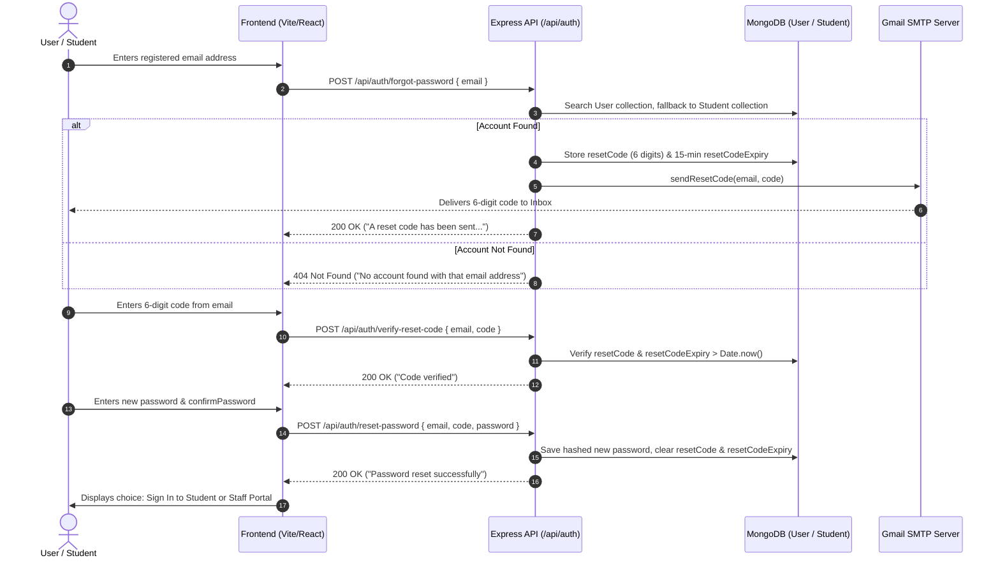

# Smartserve  - Email Password Reset Flow Guide

## Architecture Summary
The password reset system provides 6-digit OTP delivery exclusively via email (Gmail SMTP) without exposing OTP secrets in terminal logs.

---

## Technical Details

### API Endpoints
| Endpoint | Method | Body Payload | Description |
| :--- | :--- | :--- | :--- |
| `/api/auth/forgot-password` | `POST` | `{ email }` | Initiates reset, stores OTP in DB, sends email |
| `/api/auth/verify-reset-code` | `POST` | `{ email, code }` | Validates 6-digit OTP code against expiry |
| `/api/auth/reset-password` | `POST` | `{ email, code, password }` | Applies new password and clears reset fields |

### Modified Files Reference
1. `server/config/mailer.js` - Transport setup & send logs.
2. `server/controllers/passwordController.js` - Universal account search & OTP logic.
3. `server/controllers/studentAuthController.js` - Flexible student forgot-password & login.
4. `server/middleware/validators.js` - Validation field mapping (`password` / `newPassword`).
5. `client/src/pages/auth/ResetPassword.jsx` - Dual sign-in navigation options.
